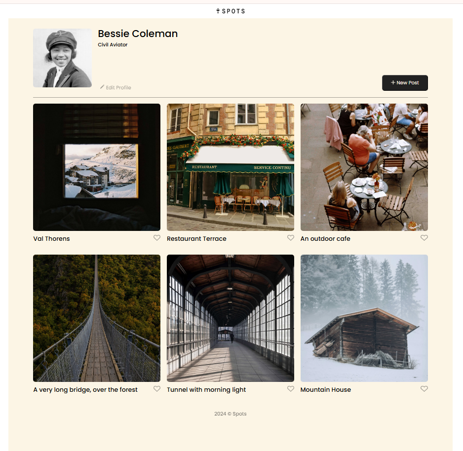

# Project 3: Spots

### Overview

- Intro
- Figma
- Images

**Intro**

This is the first stage of the third project of the fulltime Software Engineering program at TripleTen. It was created using HTML and CSS, based on the design as shown in Figma and per project specifications provided by Tripleten.

Project features:

⦁ Semantic HTML5
⦁ Flat BEM file structure and BEM Methodology
⦁ Responsive design layout using Flexbox and Grid properties
⦁ Code validated through W3C Markup Validator.
⦁ Code formatted using Prettier

**Figma**

Project is linked to Figma at https://www.figma.com/file/BBNm2bC3lj8QQMHlnqRsga/Sprint-3-Project-%E2%80%94-Spots?type=design&node-id=2%3A60&mode=design&t=afgNFybdorZO6cQo-1.

**Images**

All images have been optimized using https://tinypng.com/.

**GitHub**

Link to project on GitHub Pages:
